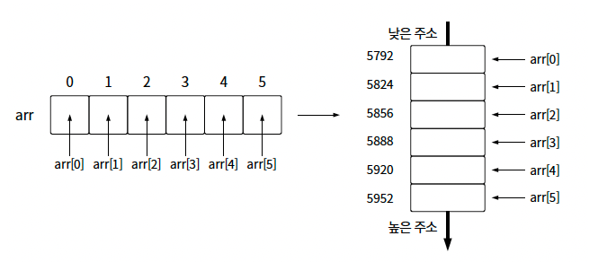
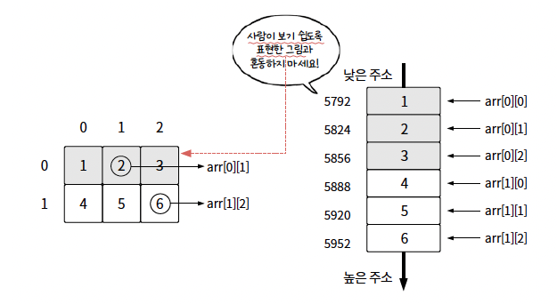
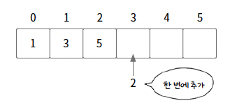
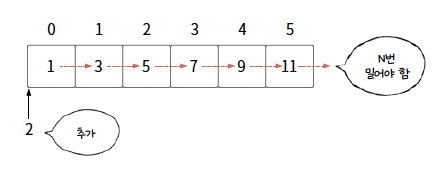
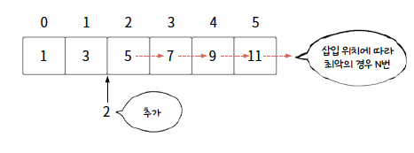

## 🙆‍♂️ 기초문법

- 배열
- ArrayList
- 배열의 시간복잡도

---

### 🔥 배열

- 인덱스와 값을 1대1 대응해 관리하는 자료구조
- 데이터를 저장할 수 있는 모든 공간은 인덱스와 1대1 대응하므로 어떤 위치에 있는 데이터든 한번에 접근 가능

```java
int[] arr = {0,0,0,0,0,0};
int[] arr2 = new int[6];

// 위 아래 동일, 배열을 생성하면 int형 배열은 기본값을 0으로 초기화
```

- 배열은 인덱스가 `0`부터 시작

```java
// 배열 주요 메서드
import java.util.Arrays;

int[] arr = {1, 2, 4, 5, 3};
System.out.println(arr.length); // 5
Arrays.sort(arr); // [1,2,3,4,5]
System.out.println(Arrays.toString(arr)); // [1,2,3,4,5]
```


#### 🍀 ArrayList 와의 차이점

- 배열은 선언할 때 배열의 크기가 결정되고, ArrayList는 동적이다
- 정확한 데이터의 개수를 알수 있다면 코드가 더 간결하고 더 빠른 배열을 사용
- 저장해야 할 데이터의 개수를 정확히 알 수 없다면 ArrayList를 사용

#### 🍀 1차원 배열

- 배열은 차원과는 무관하게 메모리에 연속 할당됨(2차원, 3차원 배열도 실제로는 1차원 공간에 저장됨)
- 배열의 각 데이터는 메모리의 `낮은 주소에서 높은 주소 방향`으로 연이어 할당됨



#### 🍀 2차원 배열

- 1차원 배열을 확장한 것

```java
int[][] arr = {{1,2,3}, {4,5,6}};
System.out.println(arr[1][2]);
arr[1][2] = 7;
System.out.println(arr[1][2]);

/*
        6
        7
 */
```



---

### 🔥 ArrayList

- 크기가 동적으로 변경되는 배열

```java
import java.util.ArrayList;

ArrayList<Integer> list = new ArrayList<>();
// 삽입
list.add(1); // [1]
list.add(2); // [1,2]
list.add(3); // [1,2,3]

// 다른 컬렉션으로부터 초기화
ArrayList<Integer> list2 = new ArrayList<>(list);
System.out.println(list2); // [1,2,3]

// 접근
System.out.println(list.get(1)); // 2

// 삭제
list.remove(list.size()-1);
System.out.println(list); // [1,2]


```

```java
// ArrayList 주요 메서드

import java.util.ArrayList;
import java.util.Arrays;
import java.util.Collections;

ArrayList<Integer> list = new ArrayList<>(Arrays.asList(1, 2, 4, 5, 3));
System.out.println(list.size()); // 5
System.out.println(list.isEmpty()); // false
Collections.sort(list); // [1,2,3,4,5]
System.out.println(list); // [1,2,3,4,5]
```

---

### 🔥 배열의 시간복잡도

- 배열은 `임의 접근`이라는 방법으로 배열의 모든 위치에 있는 데이터에 접근가능
- 데이터에 접근하기 위한 시간복잡도는 `O(1)`
- 맨 뒤에 추가하는 경우 시간복잡도는 `O(1)`



- 맨 앞에 추가하는 경우 시간복잡도는 `O(N)`



- 중간에 추가하는 경우, 밀어야 할 데이터가 N개라면 시간복잡도는 `O(N)`



#### 🍀 배열을 선택할 때 고려할 점

- 데이터에 자주 접근하거나 읽어야 하는 경우 배열을 사용하면 좋다
- 할당할 수 있는 메모리 크기를 확인
  - 1차원 배열은 1000만개
  - 2차원 배열은 3000*3000 크기
- 중간에 데이터 삽입이 많은지 확인
  - 배열은 선형 자료구조이기 때문에 중간이나 처음에 데이터를 빈번하게 삽입하면 시간복잡도가 높아져 시간초과가 발생할 수 있음