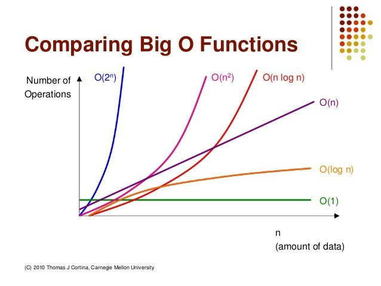
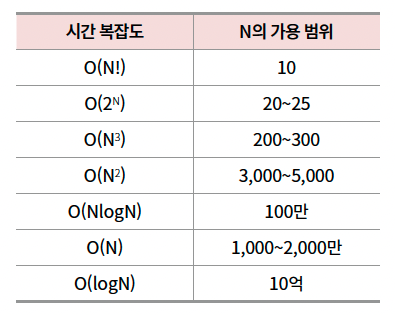

## 🙆‍♂️ 시간복잡도

- 알고리즘의 성능을 나타내는 지표
- 입력크기에 대한 연산횟수의 상한을 의미
- 시간복잡도는 낮으면 낮을수록 좋다

---

### 🔥 시간복잡도를 측정하는 방법

- `연산횟수`와 연관이 있다
- 알고리즘이 시작한 순간부터 결과값이 나올때까지의 연산횟수를 의미함
- 최선, 보통, 최악의 경우로 나눔
- 특정 입력 크기에 한하여 연산횟수를 기준으로 시간복잡도를 측정하면 안됨
- 입력크기를 N으로 일반화하여 연산횟수의 추이를 나타내야 함
- 모든 경우의 수에서 알고리즘이 문제를 처리하는 것을 고려해야 하므로 시간복잡도는 `최악의 경우를 가정`하여 이야기하는 것이 일반적임

#### 🍀 점근적 표기법

- 입력크기에 따른 연산횟수의 추이를 활용해서 시간복잡도를 표현하는 방법

### 🔥 빅오표기법

- (가장빠름)지수함수 > 다항함수 > 로그함수(가장느림) 순으로 증가
- 코딩테스트에는 제한시간이 있으므로 문제를 분석한 후에 빅오표기법을 활용해서 해당 알고리즘을 적용했을 때 제한시간내에 출력값이 나올수 있을지 확인해볼수 있다

- N의 가용범위 = 입력값의 크기 = 데이터의 개수
- 연산횟수는 1,000 ~ 3,000만 정도로 고려해서 시간복잡도를 생각하면 됨